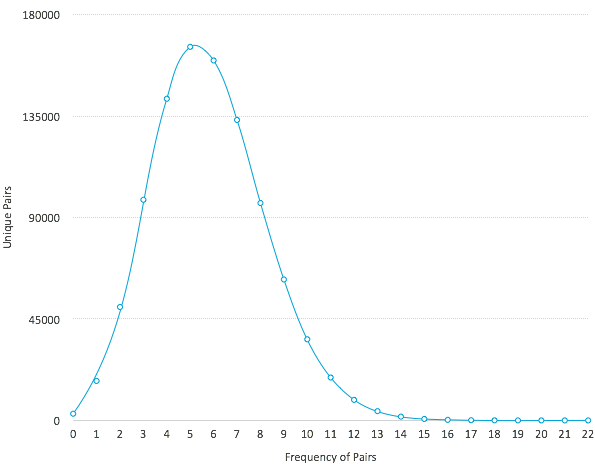

## Overview
This hack was inspired by the [RGB visualization](http://io9.com/5985749/the-worlds-largest-known-prime-number-in-rgb)
of the [largest known prime number](http://www.isthe.com/chongo/tech/math/digit/m57885161/prime-c.html).

It essentially constructs a 4000x4000 gray-scale image by setting each individual (x,y) pixel in a logical 1000x1000
matrix to a color that trends from black to white depending on how frequently the (x,y) pair appears adjacent to each
other in the prime number.

For example, given this partial sequence of the most significant digits in the prime:
```
581,887,266,232,246,442,175,100,212,113,232,368,636,370,...
```

The algorithm records the number of times (x=581,y=887), (x=887,y=266), (x=266,y=232), and so on, occurs in the sequence.
Note the distribution of pairs below.

## Distribution of pairs
Frequency of pairs | Unique pairs
--- | ---
0 | 2968
1 | 17528
2 | 50315
3 | 97875
4 | 142694
5 | 165722
6 | 159679
7 | 133283
8 | 96432
9 | 62525
10 | 35995
11 | 19026
12 | 9110
13 | 4108
14 | 1686
15 | 657
16 | 256
17 | 91
18 | 33
19 | 14
20 | 2
21 | 0
22 | 1



## License
Copyright 2013 David Edwards

Licensed under the Apache License, Version 2.0 (the "License");
you may not use this file except in compliance with the License.
You may obtain a copy of the License at

http://www.apache.org/licenses/LICENSE-2.0

Unless required by applicable law or agreed to in writing, software
distributed under the License is distributed on an "AS IS" BASIS,
WITHOUT WARRANTIES OR CONDITIONS OF ANY KIND, either express or implied.
See the License for the specific language governing permissions and
limitations under the License.
